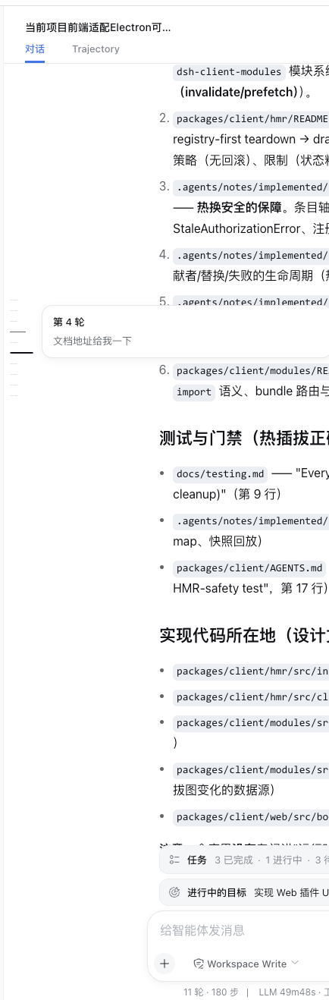

# @deepseek-ai/dsh-turn-navigator

English | [中文](README.zh.md)

A compact turn navigator for long DSH Web conversations. It follows the conversation scroll, previews a user turn on hover, and jumps to that turn on click. It stays hidden until the conversation contains at least three user turns.

## Preview



It supports keyboard focus, light and dark themes, and reduced-motion preferences. When needed, it loads only enough older history to decide whether the navigator should appear without moving the reader's current position.

## Installation

The plugin is private and not published. Its private repository is `dsh-external/dsh-turn-navigator`, but the repository remains empty until the first reviewed push. Use the local installation path until a reviewed commit is available, then start Web:

```sh
dsh plugin --profile web add -w "/path/to/dsh-turn-navigator"
dsh web
```

After the first reviewed commit is pushed, install that exact private revision with:

```sh
dsh plugin --profile web add -w github:dsh-external/dsh-turn-navigator#<reviewed-commit>
```

The checked-in `lib/` output installs without rebuilding. A compatible DSH Web version is required. To remove the plugin:

```sh
dsh plugin --profile web remove -w @deepseek-ai/dsh-turn-navigator
```

## Required DSH Web slot

This plugin registers into `conversation.chat.navigator`; it does not own or render that slot. A compatible DSH Web build must ship the same contract in both the host runtime and the official private client SDK declarations. A plugin-local type augmentation is not a substitute: it could make TypeScript pass while a host that does not render the slot silently shows no navigator.

Add the slot in the owning `@deepseek-ai/dsh-client-ui-conversation` package at these points:

1. In the slot contract, declare a session-scoped single slot whose owner supplies anchored older-history loading, and include it in the chat view's `PropsRenderSlots` union:

```ts
export interface TurnNavigatorOwnerProps {
  loadOlder: () => void
}

interface SlotMap {
  'conversation.chat.navigator': {
    kind: 'single'
    scope: 'session'
    owner: TurnNavigatorOwnerProps
  }
}
```

2. In the chat view registration, claim the child slot with the same kind and scope:

```ts
children: {
  'conversation.chat.navigator': { kind: 'single', scope: 'session' },
}
```

3. In the chat view component, render the slot beside the transcript scroll container and pass the callback that preserves the current reading row while older history is prepended:

```tsx
{renderSlot('conversation.chat.navigator', { loadOlder: loadOlderAnchored })}
```

4. Cover declaration and disposal, render dispatch, and anchored older-history loading in the host package tests, then publish a matching private SDK version for `@deepseek-ai/dsh-client-ui-conversation` and its aligned client peers. A source-only host change does not unblock an external plugin that develops only against official registry packages.

## Development and verification

The project `.npmrc` selects the private `@deepseek-ai/*` scope; pnpm 11 reads its `${NPM_TOKEN}` authentication mapping from the trusted user-level `~/.npmrc`. The SDK packages are pinned to the reviewed `0.0.1-rc.2` set. Set `NPM_TOKEN`, install without lifecycle scripts, then run the checks:

```sh
pnpm install --ignore-scripts
pnpm run check
```

Do not link a DSH source checkout into this directory. Use `pnpm run watch` beside `dsh web --dev` for live browser changes. See [`compat/`](compat/README.md) for the isolated assembled Web fixture.

## Model Experience

None. The plugin only renders existing conversation data in the browser.

#### KV Cache effect

None.

## Known Limitations and Deferred Work

- The private `0.0.1-rc.2` SDK does not yet declare the [required `conversation.chat.navigator` slot](#required-dsh-web-slot), so the full development check remains blocked until a matching official SDK release. Do not add a local type shim; the installation target must provide the real slot.
- Only loaded history receives markers; earlier turns appear after older history is loaded.
- Previews show text only.
